# MARKET LEDGER TECH CHALLENGE - Borja Perez

## How to run the application

Git clone ad cd to the repository

- `git clone https://github.com/borjaperez10/tech_challenge.git`
- `cd tech_challenge`

Run the application using docker-compose. The following command will build and run the four services used for this challenge: the grpc server, the issuer client, the investor client and the database:

- `docker-compose up`

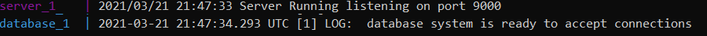

Then, the service will be started. To simulate an issuer or an investor, the following commands can be executed, which will start the issuer/investor client.

- `docker-compose run issuer`
- `docker-compose run investor`

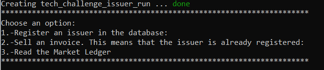    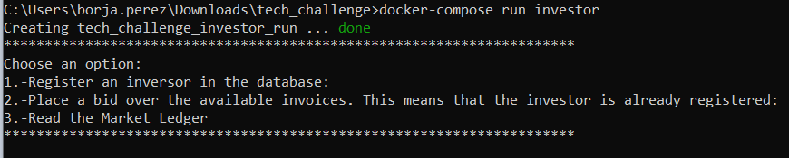

## Description of the system:

The system is composed of four main services that may be started  using a docker-compose. This section describes briefly how they work.
### Server:
This go program creates as a  gRPC server that listens in port 9000 and responds to requests that are made from issuer ad investor clients. It also deals with the PostgreSQL database, introducing or updating values.  
### Issuer
This go program is intended to emulate any issuer that wants to finance an invoice. The following image shows a block diagram of it. Marked with red colour, the used gRPC endpoints can be seen:
At the first, a gRPC connection is created and this connection is checked by sending an empty message to the server. This is done through the CheckConnectivity() gRPC method. If the connection is correctly established, the user will be requsted to introduce an option. Using a switch case statement, the following possibilities are established:

1. **Case 1 Register an Issuer:** A new issuer can be registered through the IntroduceIssuerToDatabase()gRPC method.

2. **Case 2 Sell an Invoice:** if the issuer is already registered, an invoice can be sold using the SellInvoice() gRCP method.

3. **Case 3 Read the Market Ledger:** the Market Ledger may be read through the ReadMarketLedger() gRPC method. 

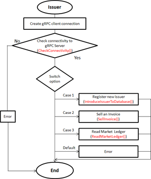

### Investor
This go program is intended to emulate any investor that wants to buy an invoice. The following image shows a block diagram of it. Marked with red colour, the used gRPC endpoints can be seen: 
At the first, a gRPC connection is created and this connection is checked by sending an empty message to the server. This is done through the CheckConnectivity() gRPC method. If the connection is correctly established, the user will be requsted to introduce an option. Using a switch case statement, the following possibilities are established:

1. **Case 1 Register an Issuer:** A new issuer can be registered through the IntroduceInvestorToDatabase()gRPC method.

2. **Case 2 Buy an Invoice:** This must be executed only if the investor is already registered. The non-closed invoices will be read(through the GetAvailableInvoices() gRPC method). The investor will select one of the invoices, and the money will be retained in his bank account thanks to the TryToModifyInvestorMoney() gRPC method. Finally, the matching algorithm is applied in order to check if the bid is correct. This is executed in the TryToCreateInvoicePart() gRPC request.

3. **Case 3 Read the Market Ledger:** the Market Ledger may be read through the ReadMarketLedger() gRPC method.

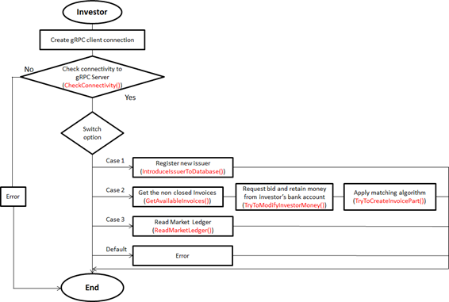

### PostgreSQL database
The system uses a database to introduce the data. When the docker-compose starts, the sql commands to create the database are executed. These values are persistent inside the docker-container until is removed. The following image shows the ER diagram of this database: 

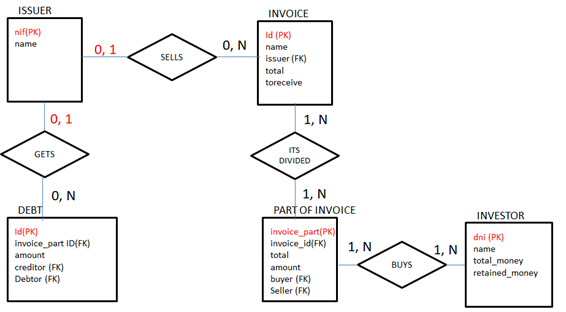

## gRPC endpoint functionalities

As described in the previous section, the system uses gRPC in order to perform the client-server communication (both investor and issuer side). Here these endpoints are described. For more information about them, the communication.proto file can be checked. 

**Checking connectivity with the server:** This endpoint is the most simple one: it sends an empty proto body request (and also receives an empty message). If the answer is received means that the server is responding, and so on, the connectivity is established. This kind of messages are executed both in the investor and issuer side.  

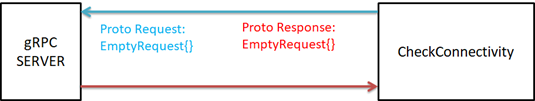

**Reading market ledger:** This endpoint is the one that reads the market ledger that is being generated in the server side. Each time an important action is performed, a new line is appended to the Market Ledger. Both the issuer and the investor can check this ledger by clicking the option number 3 in the switch-case statement. An empty proto request will be send to the server and the answer will contain a string, with all the lines that are registered in the market ledger.  

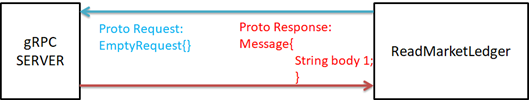
 
**Introducing Issuers to database:** This endpoint is used to register a new issuer into the database, so, this request is only possible to be made from the issuer part. In the proto request, the nif and name of the issuer must be introduced. For the proto response, we will receive a single string. 
 
 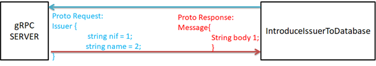
 
**Introducing investors to database:** This endpoint is the same as the previous one, but it introduces an investor instead of a issuer to the database, so, the request is only possible to be made from the investor part. In the proto request, the nif and name of the issuer must be introduced. For the proto response, we will receive a single string. 
 
 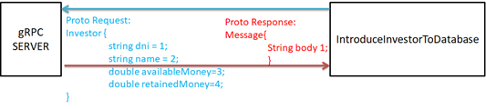
 
**Selling invoices:** This endpoint is used by a registered issuer to make an invoice sell request. The Id must not be specified, as its auto-incrementing in the database. From the request, the companyId (issuer ID, in this case the NIF), a name for the invoice, the price of the invoice, and the amount of money that wants to receive must be specified. Finally, the closed file will be set to “No”  by default, as the invoices are not set to  closed until there are buyed. The response proto request will contain a single string.
  
 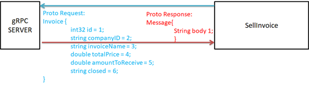

**Modifying investor’s bank account:** This endpoint is used to modify the bank account of the investors: once an investor places a bid, the amount of money of the bid will be changed to “retained” state. So, the info required for the proto request is the bid information: the dni of the investor who places the bid, the total money of the bid, the amount of money that will use to buy the bid, and a string named action, which is established in this case as “rm” indicating remove action. 

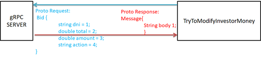

**Creating Invoice part and applying the matching algorithm:**  this is the most complex endpoint. It receives the information needed to create an invoice part (the original invoice id, the name that will be given to the invoice part, the total money of the part, the amount that will be payed, the buyer and the seller). Using all this data, the server will check if the bid is correct through the matching algorithm. If the bid is incorrect, a function to Modify the investor’s moey will be executed, in this case with the “add” action, which adds the money to the investor’s account. If the bid is correct, the server will create an invoice part, and it will check if the original invoice is 100% financed using the parts. If the invoice gets fully financed, the bid will be readjusted, and the function that modifies the bank account will be recalled (with the action=add). 
At this point, the invoice will be set to closed, and finally, the payment will be executed, and the debt created. This will remove the money from the “retained” state, and will introduce a new debt (the issuer will have a debt with the investor) in the database. 

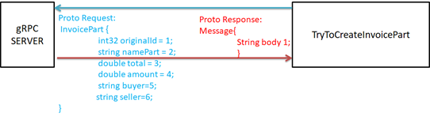
 
**Getting all the available invoices:** This endpoint sends an Empty request proto message, and returns a stream of Invoices: all the available invoices will be returned as proto messages, including the folowing body of the request:

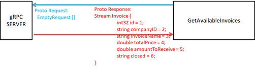

## Example of the system

Once the server is running (docker-compose up command will run it), we can execute both the issuer or investor. For this example, we will create three issuers and three investors:

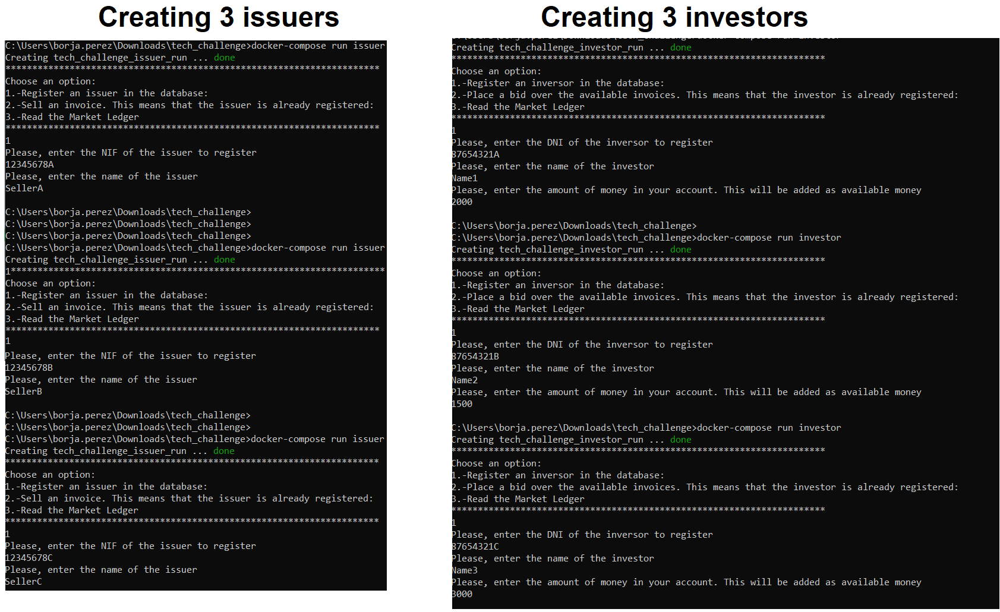

Now, SellerB and SellerC are going to put an invoice to sell. In this case, SellerB will sell an invoice Invoice-1 of $1200, and will request for $1100. SellerC will sell an invoice Invoice1 of $1000 and will request $900.

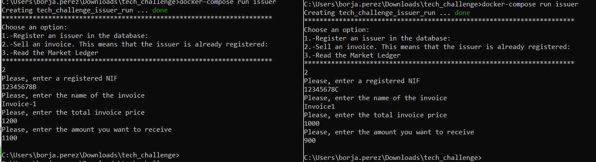

Now, we will simulate that Investor1 makes a bid to the first invoice of $900, with amount $850. We will simulate that Investor2 makes a bid, also for first invoice of $200, with amount $180. First bid is introduced, but second one is rejected, due to the bid difference (seller was asking for $1100 from $1200 invoice, which has higher discount than the bid $180/$200). 

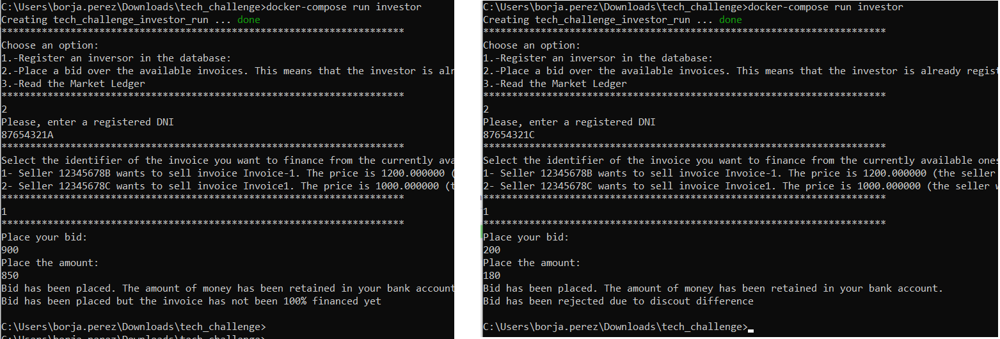

Then, we will simulate other two bids from Investor2 and Investor 3. It can be seen that finally, the bid is fully financed:

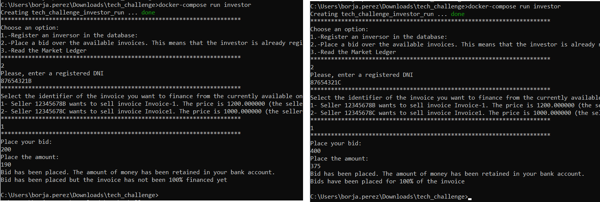

Both from the issuer or investor side, the Market Ledger can be readed by entering a 3 in the options menu. The following image shows the output of the Market Ledger. It can be seen that, at the first moment, Sellers B and C have placed their sell - order. Then, Investor1 and 3 have placed their bid, and their money has been retained in their account. Due to the fact that bid of Investor3 has been rejected, his money has been returned. Then, Investor2 and 3 have placed their bids, and the money has been retained in their bank account. Finally, as the invoice has been fully financed, the final bid has been recalculated, and the difference of money has been returned back. We can finally see the transaction details and profit for each of the investors.

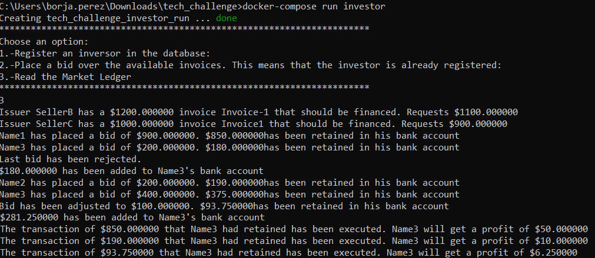

If we try to buy another invoice, we will see that the previous invoice has dissappeared from the invoice list, as it's state has been changed to closed=yes.

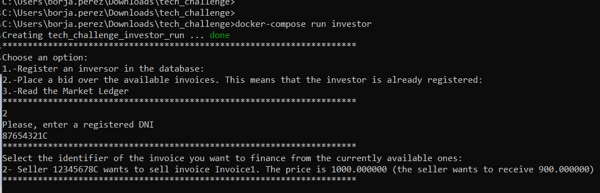

